# Bike User Journey Map — Two-Wheeler Insurance

Complete end-to-end flowcharts for the ACKO conversational bike insurance buy platform

**Table of Contents**
1. [Master Journey Overview](#s1)
2. [Entry & Vehicle Type Selection](#s2)
3. [Preliminary Checks & Validations](#s3)
4. [Journey 1 — Existing Bike Owner (Renewal/Switch)](#s4)
5. [Journey 2 — New Bike Buyer](#s5)
6. [Data Collection & Verification](#s6)
7. [Login Logic — Skippable & Mandatory Gates](#s7)
8. [Quote & Plan Selection](#s8)
9. [Plan Type Routing (Comprehensive/OD/TP)](#s9)
10. [Add-on Personalisation](#s10)
11. [Confirm Details](#s11)
12. [Review & Payment](#s12)
13. [Post-Purchase & Policy Issuance](#s13)
14. [PWILO — Pick Up Where I Left Off](#s14)
15. [Journey Phase Summary](#s15)
16. [Step Reference Table](#s16)

## 1. Master Journey Overview {#s1}

Highest-level view of the entire bike insurance journey. Both existing owner and new buyer flows converge at plan selection after different data collection phases.

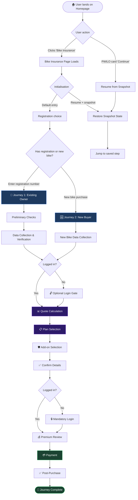

## 2. Entry & Vehicle Type Selection {#s2}

The journey begins when the user selects "Bike Insurance" from the homepage. Users can either enter an existing registration number or indicate they're buying a new bike.

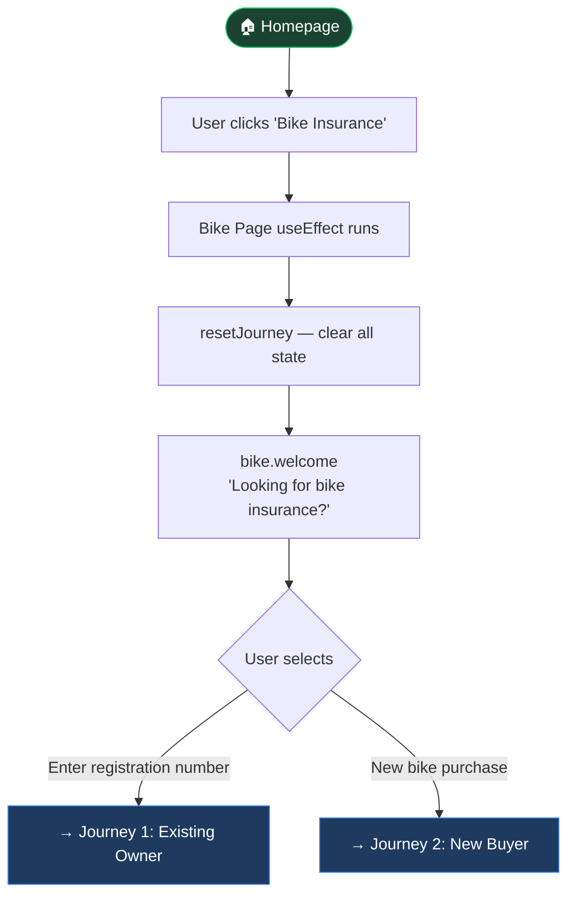

## 3. Preliminary Checks & Validations {#s3}

When a user enters a registration number, these checks are performed before proceeding to data collection.

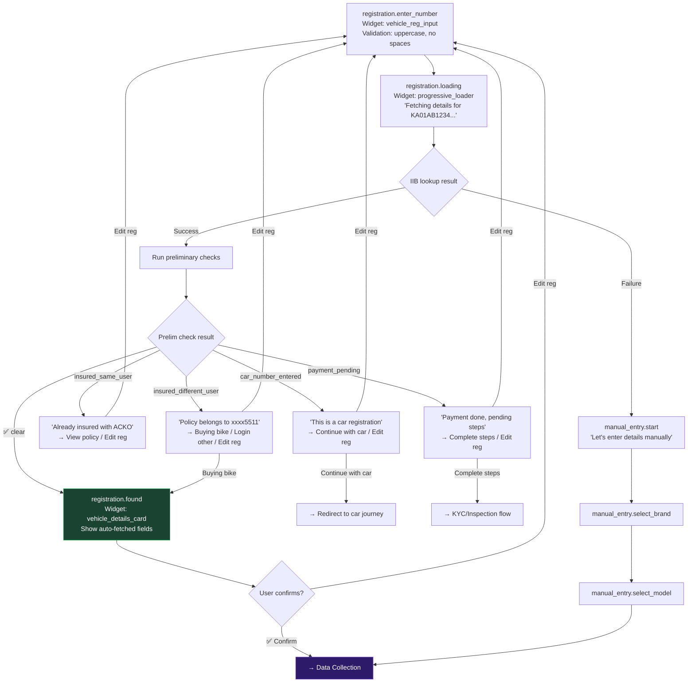

## 4. Journey 1 — Existing Bike Owner (Renewal/Switch) {#s4}

Handles users who own an existing bike and want to renew their expiring policy or switch to ACKO.

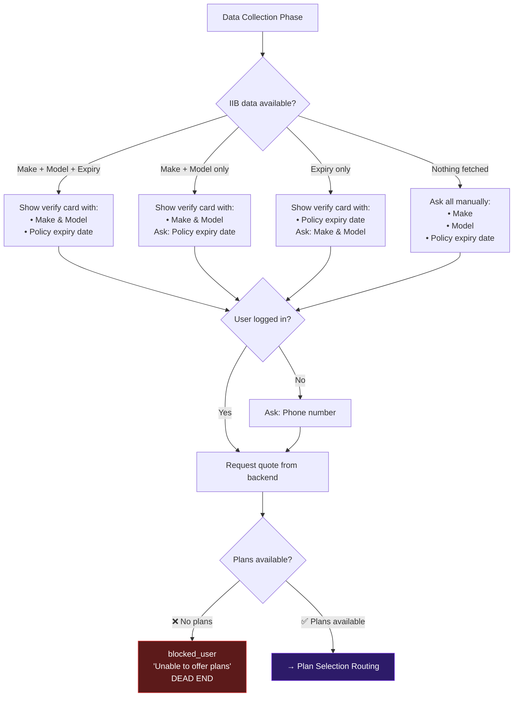

## 5. Journey 2 — New Bike Buyer {#s5}

Handles users purchasing a brand new bike who need first-time insurance coverage.

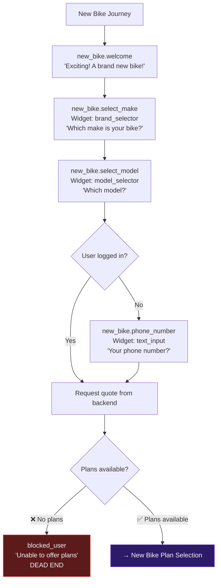

## 6. Data Collection & Verification {#s6}

Detailed view of how the system handles the all-or-nothing framework for auto-fetched vs manually entered data.

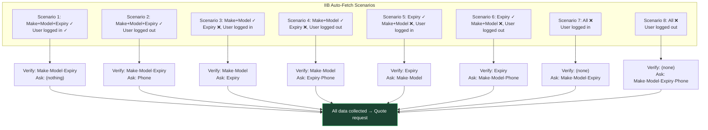

## 7. Login Logic — Skippable & Mandatory Gates {#s7}

### Skippable Login Gate

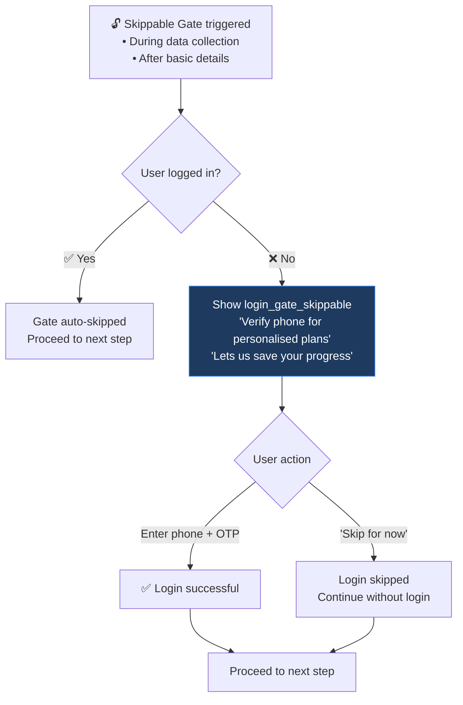

### Mandatory Login Gate

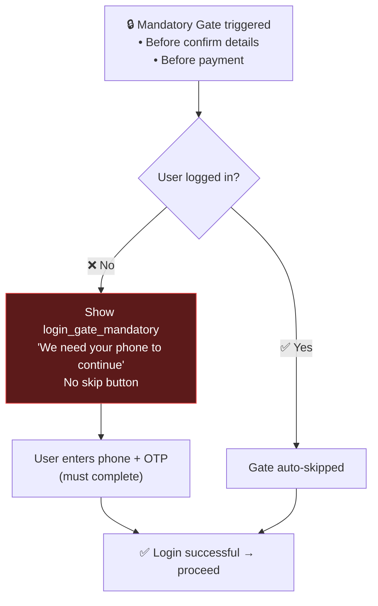

## 8. Quote & Plan Selection {#s8}

After data collection, the system calculates quotes and presents plan options based on bike eligibility.

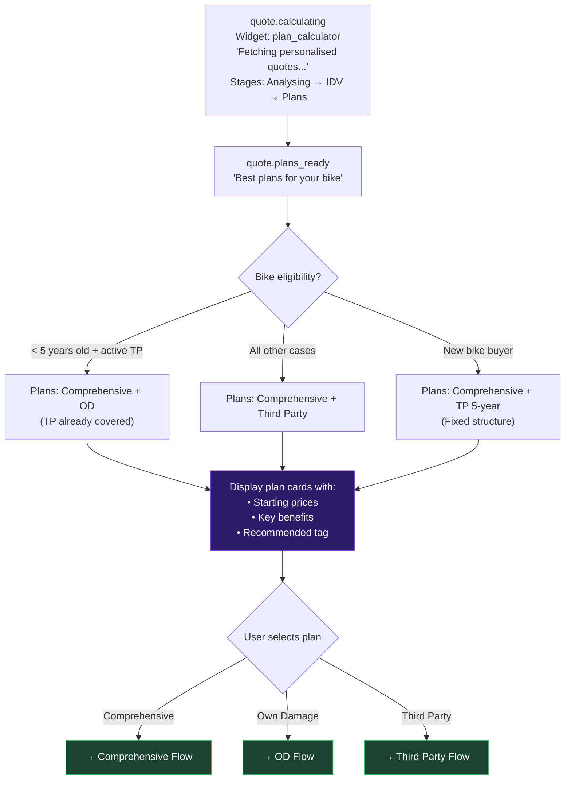

## 9. Plan Type Routing (Comprehensive/OD/TP) {#s9}

Different tenure selection flows based on the selected plan type.

### Journey 1 Plans (Existing Owner)

```mermaid
flowchart TB
    subgraph COMPREHENSIVE ["Comprehensive Plan"]
        COMP_SELECT["User selects Comprehensive"] --> COMP_TENURE["Select tenure:\n1 Year · 2 Years · 3 Years"]
        COMP_TENURE --> COMP_NUDGE["Nudge towards 3 years:\n'Save ₹XXX with 3-year plan'\n'Best value' tag on 3-year"]
        COMP_NUDGE --> COMP_DONE["Comprehensive plan selected"]
    end

    subgraph OD_ONLY ["Own Damage Plan"]  
        OD_SELECT["User selects Own Damage"] --> OD_TENURE["Select tenure:\n1 Year · 2 Years · 3 Years"]
        OD_TENURE --> OD_NUDGE["Nudge towards 3 years:\nShow annual savings"]
        OD_NUDGE --> OD_DONE["OD plan selected"]
    end

    subgraph TP_ONLY ["Third Party Plan"]
        TP_SELECT["User selects Third Party"] --> TP_TENURE["Select tenure:\n1 Year · 2 Years · 3 Years"]
        TP_TENURE --> TP_NUDGE["Nudge towards 3 years:\nShow cost benefits"]
        TP_NUDGE --> TP_DONE["TP plan selected"]
    end

    COMP_DONE --> ADDONS["→ Add-on Selection"]
    OD_DONE --> ADDONS
    TP_DONE --> ADDONS

    style ADDONS fill:#2d1b69,stroke:#7c3aed,color:#fff
```

### Journey 2 Plans (New Bike)

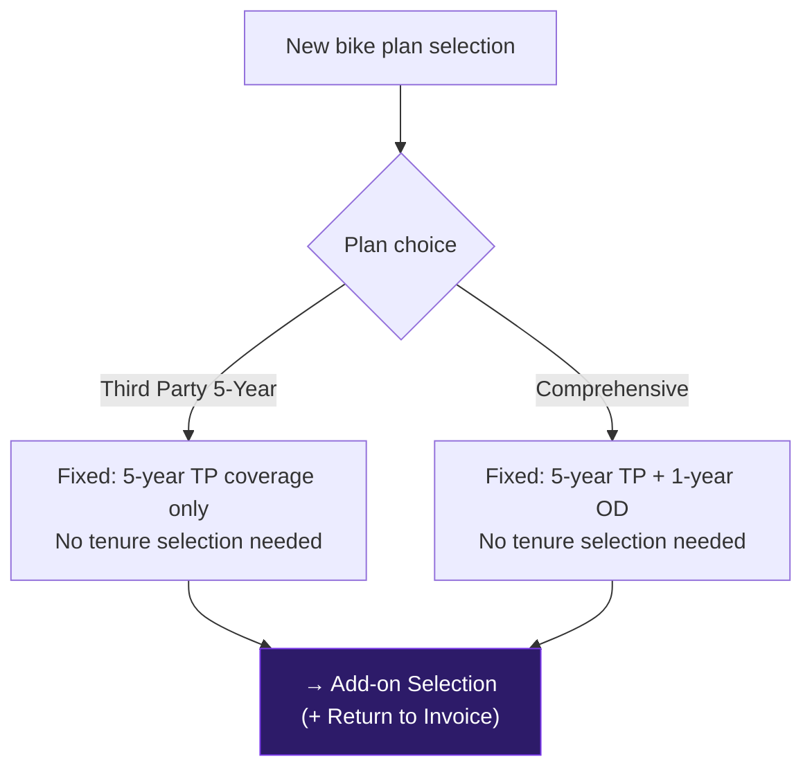

## 10. Add-on Personalisation {#s10}

Two-wheeler add-ons are grouped into family protection and bike protection categories.

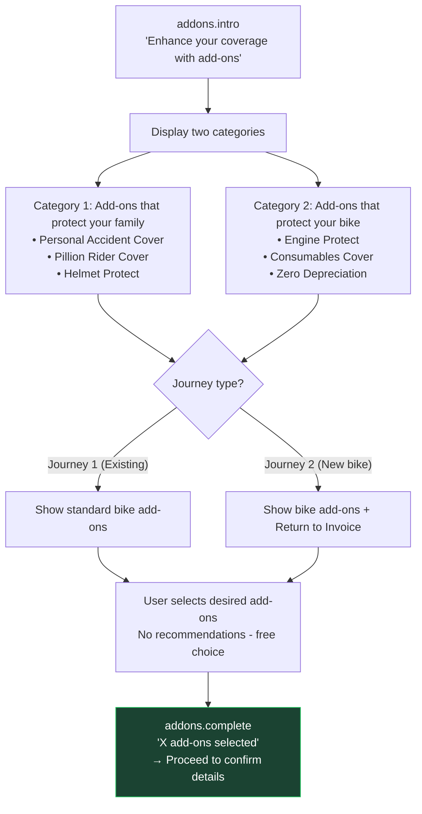

### Add-on Catalogue Details

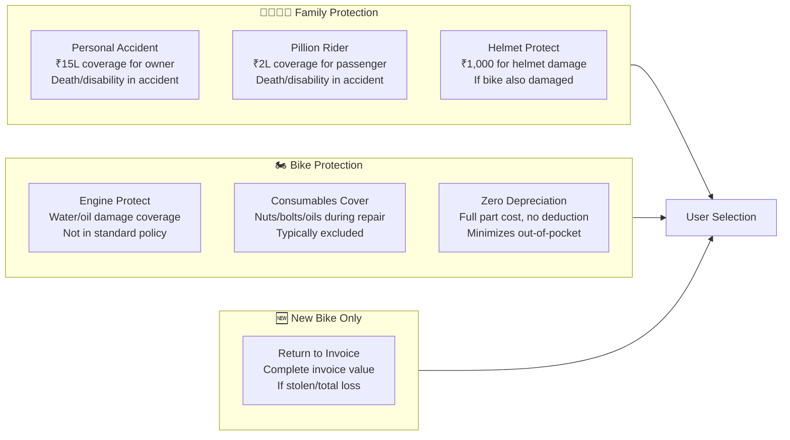

## 11. Confirm Details {#s11}

Collection and reconfirmation of key details before proceeding to payment review.

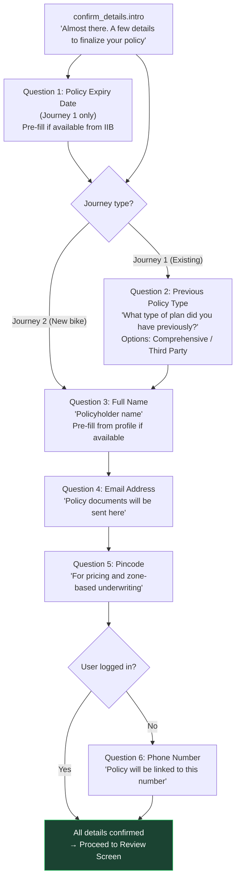

## 12. Review & Payment {#s12}

Final review screen where users see complete breakdown before payment.

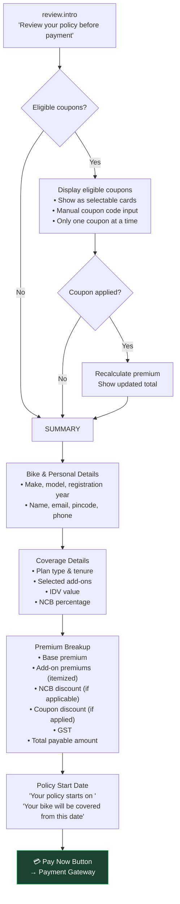

## 13. Post-Purchase & Policy Issuance {#s13}

After successful payment, guide user through policy issuance and next steps.

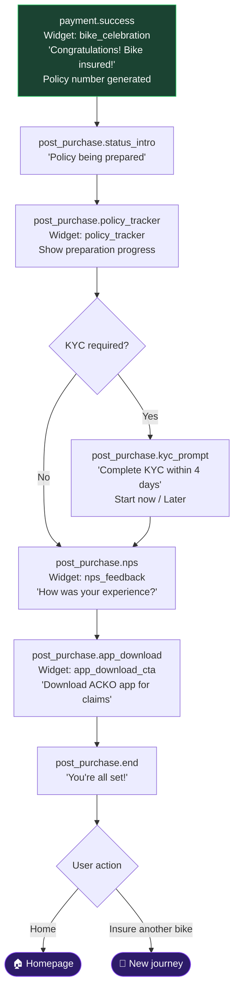

## 14. PWILO — Pick Up Where I Left Off {#s14}

Journey state auto-save and resume functionality for bike insurance purchase.

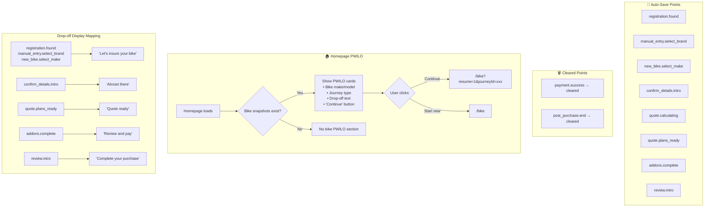

## 15. Journey Phase Summary {#s15}

**For stakeholders and non-technical users**

| Phase | Journey 1 (Existing Owner) | Journey 2 (New Buyer) | Key Actions |
|-------|---------------------------|------------------------|-------------|
| **Entry** | Enter registration number | Select "New bike purchase" | Vehicle identification |
| **Validation** | Preliminary checks for existing policies | Skip validation checks | Avoid duplicate coverage |
| **Data Collection** | Auto-fetch + manual questions for missing fields | Manual entry of make/model only | Complete bike profile |
| **Login** | Optional login for personalization | Optional login for personalization | Account linking |
| **Quote Generation** | Request plans based on complete profile | Request new bike plans | Calculate premiums |
| **Plan Selection** | Choose from Comprehensive/OD/TP with tenure | Choose from fixed-tenure options | Coverage decision |
| **Add-ons** | Select from standard bike add-ons | Select from enhanced add-ons + RTI | Extra protection |
| **Confirmation** | Confirm policy + personal details | Confirm personal details only | Final verification |
| **Review** | Complete premium breakdown with NCB | Simplified breakdown for new bike | Payment preparation |
| **Payment** | Complete transaction | Complete transaction | Policy activation |
| **Post-Purchase** | Policy issuance + KYC if needed | Policy issuance + KYC if needed | Service completion |

## 16. Step Reference Table {#s16}

| Module | Step ID | Widget Type | Purpose | Journey |
|--------|---------|-------------|---------|---------|
| **registration** | registration.enter_number | vehicle_reg_input | Enter bike registration | J1 |
| | registration.loading | progressive_loader | Fetch bike details from IIB | J1 |
| | registration.found | vehicle_details_card | Show verify card | J1 |
| **prelim** | prelim.insured_same_user | selection_cards | Already insured (same user) | J1 |
| | prelim.insured_different_user | selection_cards | Already insured (different user) | J1 |
| | prelim.car_number_entered | selection_cards | Car registration entered | J1 |
| | prelim.payment_pending | selection_cards | Payment done, steps pending | J1 |
| **manual_entry** | manual_entry.start | none | IIB fetch failed | J1 |
| | manual_entry.select_brand | brand_selector | Bike make | J1 |
| | manual_entry.select_model | model_selector | Bike model | J1 |
| **new_bike** | new_bike.welcome | none | New bike excitement | J2 |
| | new_bike.select_make | brand_selector | Bike make | J2 |
| | new_bike.select_model | model_selector | Bike model | J2 |
| | new_bike.phone_number | text_input | Mobile number | J2 |
| **quote** | quote.calculating | plan_calculator | Calculate plans | Both |
| | quote.plans_ready | none | Plans found | Both |
| | quote.plan_selection | plan_selector | Plan cards | Both |
| | quote.tenure_selection | tenure_selector | Tenure choice | J1 only |
| **addons** | addons.intro | none | Add-on introduction | Both |
| | addons.family_protection | family_addon_cards | Family add-ons | Both |
| | addons.bike_protection | bike_addon_cards | Bike add-ons | Both |
| | addons.complete | none | Add-on summary | Both |
| **confirm_details** | confirm_details.intro | none | Details confirmation intro | Both |
| | confirm_details.policy_expiry | text_input | Previous policy expiry | J1 only |
| | confirm_details.policy_type | selection_cards | Previous policy type | J1 only |
| | confirm_details.name | text_input | Policyholder name | Both |
| | confirm_details.email | text_input | Email address | Both |
| | confirm_details.pincode | text_input | Pincode | Both |
| | confirm_details.phone | text_input | Phone number | Both |
| **login** | login.optional_gate | login_gate_skippable | Skippable login | Both |
| | login.mandatory_gate | login_gate_mandatory | Mandatory login | Both |
| **review** | review.intro | none | Review introduction | Both |
| | review.coupons | coupon_selector | Available coupons | Both |
| | review.summary | premium_breakdown | Premium breakdown | Both |
| | review.pay_now | payment_gateway | Payment CTA | Both |
| **payment** | payment.process | payment_gateway | Payment processing | Both |
| | payment.success | bike_celebration | Success celebration | Both |
| **post_purchase** | post_purchase.status_intro | none | Policy prep intro | Both |
| | post_purchase.policy_tracker | policy_tracker | Issuance tracker | Both |
| | post_purchase.kyc_prompt | selection_cards | KYC prompt | Both |
| | post_purchase.nps | nps_feedback | Experience rating | Both |
| | post_purchase.app_download | app_download_cta | App download | Both |
| | post_purchase.end | selection_cards | Journey completion | Both |

---

**Legend:**
- **J1**: Journey 1 (Existing bike owner)
- **J2**: Journey 2 (New bike buyer)  
- **Both**: Available in both journeys