# User Journey Map — Car Insurance

This document maps the **complete end-to-end user journey** for car insurance on the ACKO conversational buy platform. It is the single source of truth for how a user moves through every screen, decision point, validation, and login gate — from the moment they land on the homepage to the post-purchase experience.

---

## Table of Contents

1. [Master Journey Overview](#1-master-journey-overview)
2. [Entry & Vehicle Type Selection](#2-entry--vehicle-type-selection)
3. [Renewal vs Brand New Fork](#3-renewal-vs-brand-new-fork)
4. [Branch A — Renewal (Existing Vehicle)](#4-branch-a--renewal-existing-vehicle)
5. [Branch B — Brand New Vehicle](#5-branch-b--brand-new-vehicle)
6. [Login Logic — Skippable & Mandatory Gates](#6-login-logic--skippable--mandatory-gates)
7. [Quote & Plan Selection](#7-quote--plan-selection)
8. [Plan Combination Routing](#8-plan-combination-routing)
9. [Add-on Personalisation](#9-add-on-personalisation)
10. [Owner Details & Pre-Payment](#10-owner-details--pre-payment)
11. [Payment & Post-Purchase](#11-payment--post-purchase)
12. [PWILO — Pick Up Where I Left Off](#12-pwilo--pick-up-where-i-left-off)
13. [Step Reference Table](#13-step-reference-table)

---

## 1. Master Journey Overview

This is the highest-level view of the entire car insurance journey. Both renewal and brand new flows converge at the quote & plan selection stage.

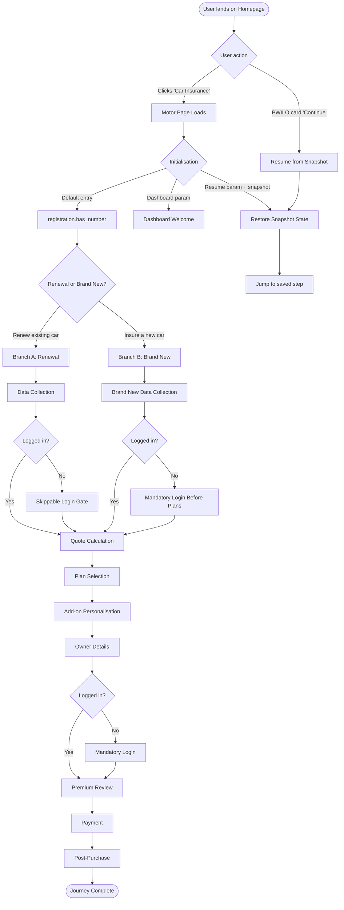

---

## 2. Entry & Vehicle Type Selection

The journey begins when the user selects "Car Insurance" from the homepage. The motor page initialises and routes the user to the first conversational step.

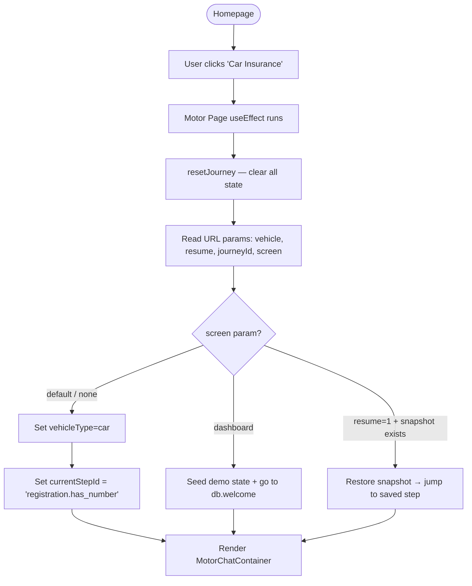

**Key behaviour:**
- All users bypass `LoginChatFlow` and enter `MotorChatContainer` directly
- Vehicle type defaults to `car` (URL param `vehicle=bike` switches to bike)
- The first visible step is always `registration.has_number`

---

## 3. Renewal vs Brand New Fork

The first user-facing question determines the entire journey branch.

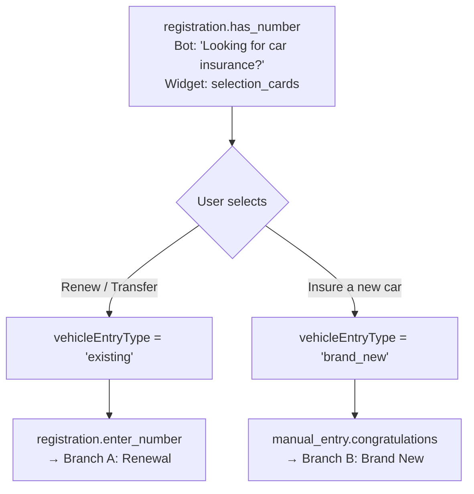

**Validation:**
- `vehicleEntryType` is set to `existing` or `brand_new` — this controls routing throughout the rest of the journey

---

## 4. Branch A — Renewal (Existing Vehicle)

This branch handles users who have an existing car and want to renew or transfer their insurance.

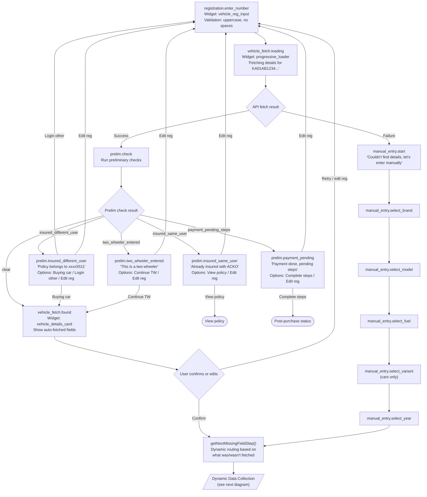

### Dynamic Data Collection (Renewal)

After the verify card, the system asks **only** for fields that were not auto-fetched, in strict order.

```mermaid
flowchart TB
    START_MISSING["getNextMissingFieldStep()"] --> CHECK_CAR{Car details fetched?}

    CHECK_CAR -->|No — any car field missing| ASK_CAR["Ask: Make → Model → Fuel → Variant → Year<br/>(only missing ones, in order)"]
    CHECK_CAR -->|Yes| CHECK_COMMERCIAL{Commercial check done?}

    ASK_CAR --> CHECK_COMMERCIAL

    CHECK_COMMERCIAL -->|No — car only| COMMERCIAL["pre_quote.commercial_check<br/>'Personal or commercial use?'"]
    CHECK_COMMERCIAL -->|Yes or bike| CHECK_POLICY{Policy details fetched?}

    COMMERCIAL -->|Personal| CHECK_POLICY
    COMMERCIAL -->|Commercial| REJECT["pre_quote.commercial_rejection<br/>'Cannot cover commercial vehicles'<br/>Dead end"]

    CHECK_POLICY -->|No| ASK_POLICY_TYPE["pre_quote.policy_type_ask<br/>'What type of policy did you have?'<br/>Comprehensive / Third Party / Not sure"]
    CHECK_POLICY -->|Yes| CHECK_PINCODE

    ASK_POLICY_TYPE --> ASK_POLICY_STATUS["pre_quote.policy_status<br/>'Active, Expired, or Not sure?'"]

    ASK_POLICY_STATUS -->|Active| CLAIM_HISTORY["pre_quote.claim_history<br/>'Any claims this year?'"]
    ASK_POLICY_STATUS -->|Expired / Not sure| EXPIRED_FLOW["Expired flow:<br/>expired_policy_type →<br/>expiry_window →<br/>expired_claim_history →<br/>expired_insurer"]

    CLAIM_HISTORY --> CHECK_NCB{NCB fetched?}
    EXPIRED_FLOW --> CHECK_PINCODE

    CHECK_PINCODE{Pincode collected?} -->|No| ASK_PINCODE["pre_quote.pincode_ask<br/>'Pincode where car is registered?'"]
    CHECK_PINCODE -->|Yes| CHECK_LOGIN

    ASK_PINCODE --> CHECK_LOGIN

    CHECK_LOGIN{User logged in?} -->|No| SKIP_GATE["login.phone_gate_prequote<br/>Widget: login_gate_skippable<br/>'Verify your phone for personalised plans'<br/>Can skip or complete"]
    CHECK_LOGIN -->|Yes| CHECK_NCB

    SKIP_GATE --> CHECK_NCB

    CHECK_NCB -->|No — policy fetched but NCB missing| ASK_NCB["pre_quote.ncb_selection<br/>Widget: ncb_selector<br/>'What is your NCB %?'"]
    CHECK_NCB -->|Yes| CHECK_CLAIM

    ASK_NCB --> NCB_REWARD{NCB increased?}
    NCB_REWARD -->|Yes| SHOW_REWARD["pre_quote.ncb_reward<br/>'Your NCB increased to X%!'"]
    NCB_REWARD -->|No| CHECK_CLAIM
    SHOW_REWARD --> CHECK_CLAIM

    CHECK_CLAIM{Last claim fetched?} -->|No| ASK_CLAIM["pre_quote.last_claim_ask<br/>'Did you claim last year?'"]
    CHECK_CLAIM -->|Yes| CHECK_CNG

    ASK_CLAIM --> CHECK_CNG

    CHECK_CNG{CNG check done?} -->|No — car only| ASK_CNG["pre_quote.cng_check<br/>'External CNG kit fitted?'"]
    CHECK_CNG -->|Yes or bike| SUMMARY

    ASK_CNG --> SUMMARY

    SUMMARY["pre_quote.summary<br/>Widget: editable_summary<br/>'Review your details'"]
    SUMMARY --> VIEW_PRICES["pre_quote.view_prices<br/>'Fetching plans...'"]
    VIEW_PRICES --> LOGIN_CHECK_2{Logged in?}
    LOGIN_CHECK_2 -->|Yes| QUOTE_CALC([→ Quote Calculation])
    LOGIN_CHECK_2 -->|No| MANDATORY_BEFORE_PLANS["login.phone_gate_before_plans<br/>Widget: login_gate_mandatory<br/>MUST complete to see plans"]
    MANDATORY_BEFORE_PLANS --> QUOTE_CALC
```

---

## 5. Branch B — Brand New Vehicle

This branch handles users buying a new car who need insurance before or at delivery.

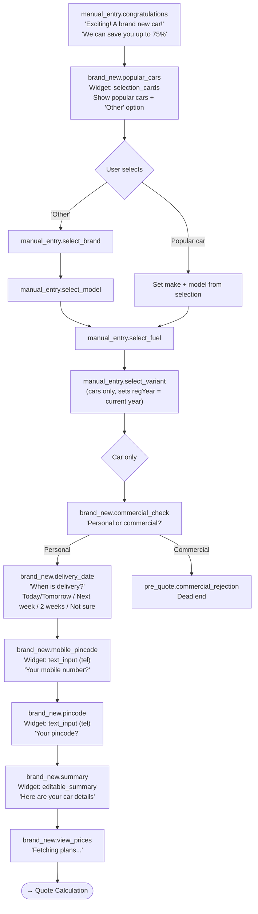

**Key differences from renewal:**
- No registration number needed
- Popular car shortcuts speed up entry
- Commercial check is inline (not deferred)
- Mobile and pincode collected before summary
- Delivery window collected (not relevant for renewal)

---

## 6. Login Logic — Skippable & Mandatory Gates

Login gates appear at strategic points in the journey. The skippable gate collects the phone early for a better experience; the mandatory gate ensures login before critical steps.

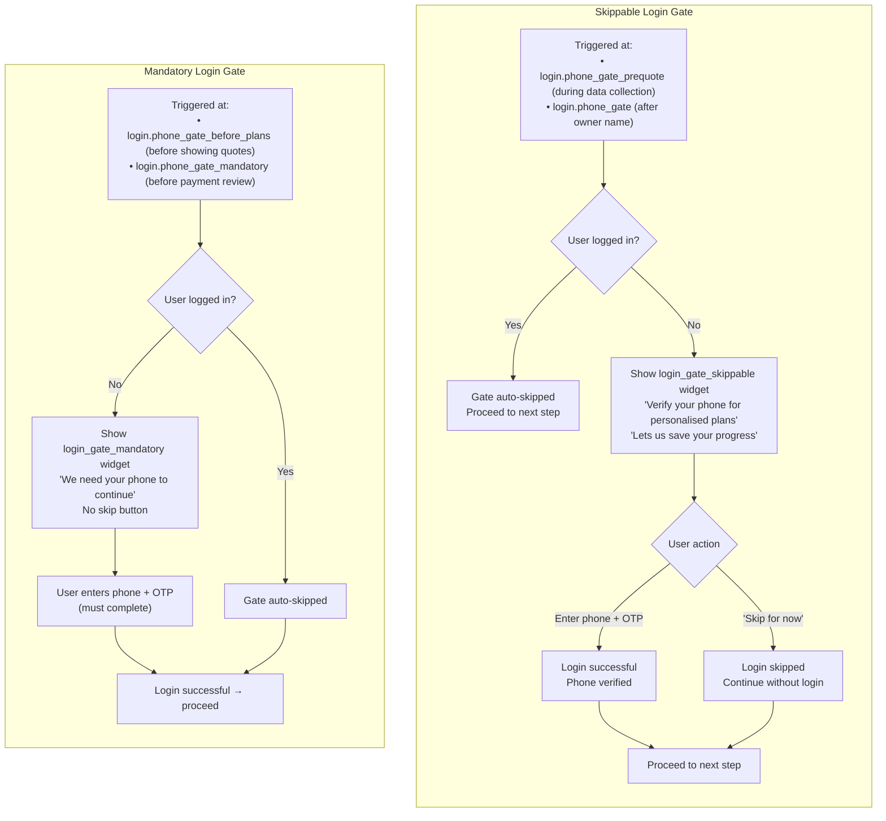

### Login Gate Placement in the Journey

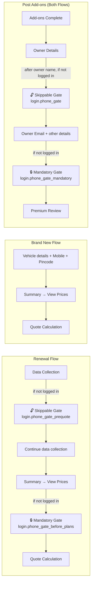

### OTP Verification Flow

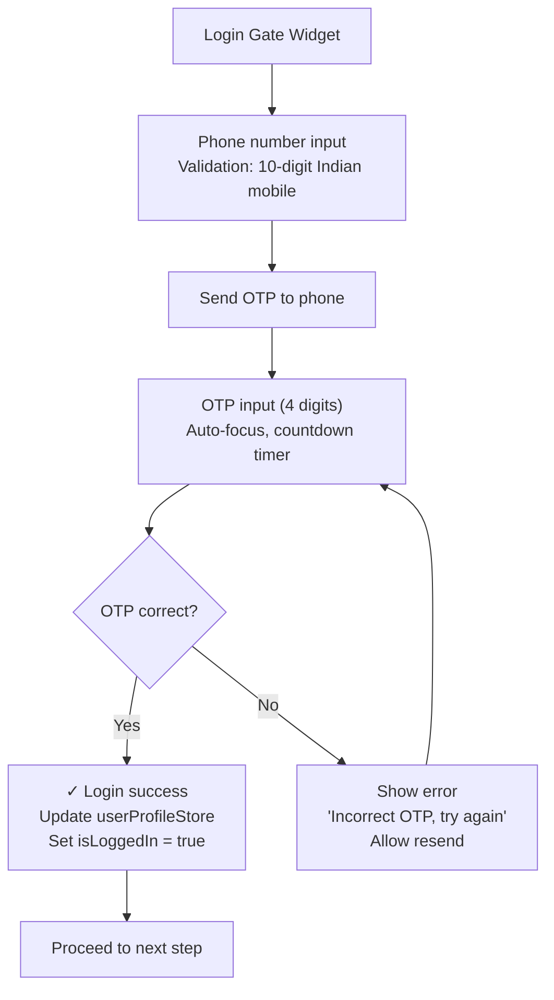

---

## 7. Quote & Plan Selection

After all data is collected, the system calculates quotes and presents plan options.

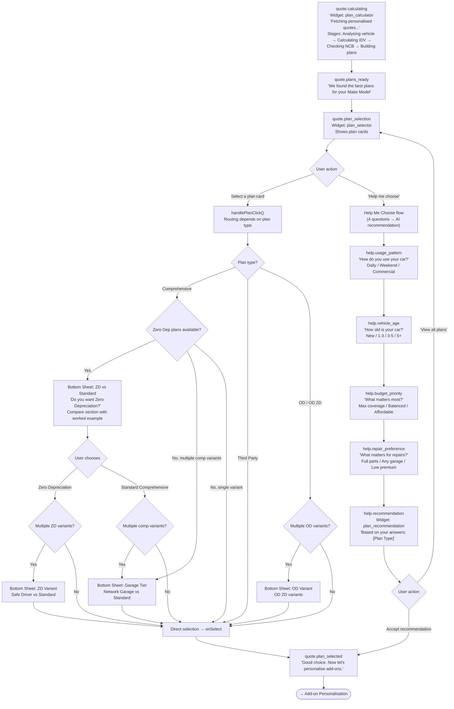

---

## 8. Plan Combination Routing

The system determines which plan combination to serve based on vehicle age and policy status.

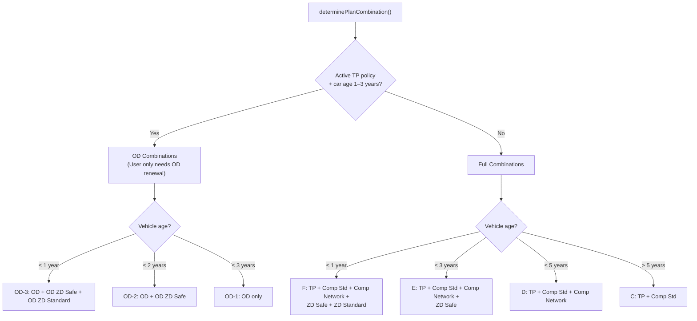

### Plan Cards Displayed

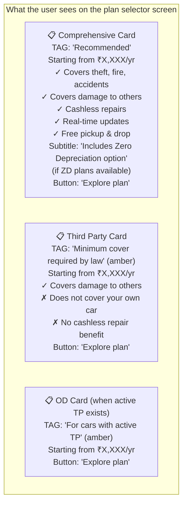

### Bottom Sheet Flows After Plan Card Click

```mermaid
flowchart TB
    subgraph "Comprehensive → Bottom Sheet Flow"
        C_CLICK["User clicks 'Explore plan'<br/>on Comprehensive card"]
        C_CLICK --> C_ZD_CHECK{"ZD plans available?<br/>(Combinations E or F)"}

        C_ZD_CHECK -->|Yes| BS_ZD_VS_STD["Bottom Sheet 1: ZD vs Standard<br/>'Do you want Zero Depreciation cover?'<br/>┌──────────────────────────┐<br/>│ Zero Depreciation (Rec.) │<br/>│ Starting from ₹X,XXX/yr  │<br/>│ ✓ Full cost of parts     │<br/>│ ✓ Zero out-of-pocket     │<br/>├──────────────────────────┤<br/>│ Standard Comprehensive   │<br/>│ Starting from ₹X,XXX/yr  │<br/>│ ✓ Parts after depreciation│<br/>│ ℹ 20-30% out-of-pocket   │<br/>├──────────────────────────┤<br/>│ Compare: Bumper ₹15,000  │<br/>│ ZD: You pay ₹0           │<br/>│ Std: You pay ₹3-4.5K     │<br/>└──────────────────────────┘"]

        BS_ZD_VS_STD -->|Zero Dep| ZD_VARIANT_CHECK2{"Multiple ZD variants?<br/>(Combination F)"}
        BS_ZD_VS_STD -->|Standard| COMP_VARIANT_CHECK2{"Multiple comp variants?<br/>(Combinations D, E, F)"}

        ZD_VARIANT_CHECK2 -->|Yes| BS_ZD_VAR["Bottom Sheet 2: ZD Variant<br/>┌───────────────────────────────┐<br/>│ TAG: Recommended · Best value │<br/>│ ZD · Safe Driver              │<br/>│ ₹X,XXX/yr                    │<br/>│ ✓ Built for responsible owners│<br/>│ ✓ Lower premium               │<br/>│ ⚡ Claim: ₹5,000 deductible  │<br/>├───────────────────────────────┤<br/>│ ZD · Standard                 │<br/>│ ₹X,XXX/yr (higher)           │<br/>│ ✓ No deductions of any kind   │<br/>│ (or GREYED if unavailable)    │<br/>└───────────────────────────────┘"]
        ZD_VARIANT_CHECK2 -->|No (only Safe Driver)| SELECT_DONE

        COMP_VARIANT_CHECK2 -->|Yes| BS_GARAGE["Bottom Sheet 2: Garage Tier<br/>┌───────────────────────────────┐<br/>│ TAG: Recommended · Managed    │<br/>│ Comp · Network Garage         │<br/>│ ₹X,XXX/yr                    │<br/>│ ✓ All Comp benefits + lower   │<br/>│ ✓ Fully managed claims        │<br/>│ ⚡ ₹5K deductible outside net │<br/>│ [See garages near you →]      │<br/>├───────────────────────────────┤<br/>│ Comp · Standard               │<br/>│ ₹X,XXX/yr (higher)           │<br/>│ ✓ Any GST garage, no limits   │<br/>│ (or GREYED if unavailable)    │<br/>└───────────────────────────────┘"]
        COMP_VARIANT_CHECK2 -->|No| SELECT_DONE

        C_ZD_CHECK -->|No, multiple comp variants| BS_GARAGE
        C_ZD_CHECK -->|No, single comp variant| SELECT_DONE

        BS_ZD_VAR --> SELECT_DONE
        BS_GARAGE --> SELECT_DONE

        SELECT_DONE["Plan selected → Proceed to add-ons"]
    end
```

---

## 9. Add-on Personalisation

After plan selection, personalisation questions determine which add-ons are recommended.

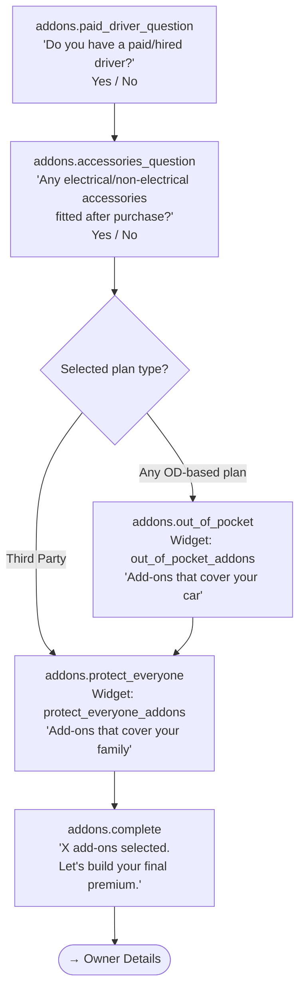

### Add-on Recommendation Logic

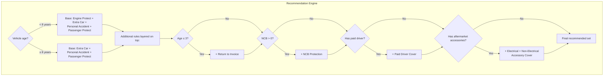

### Add-on Display Rules

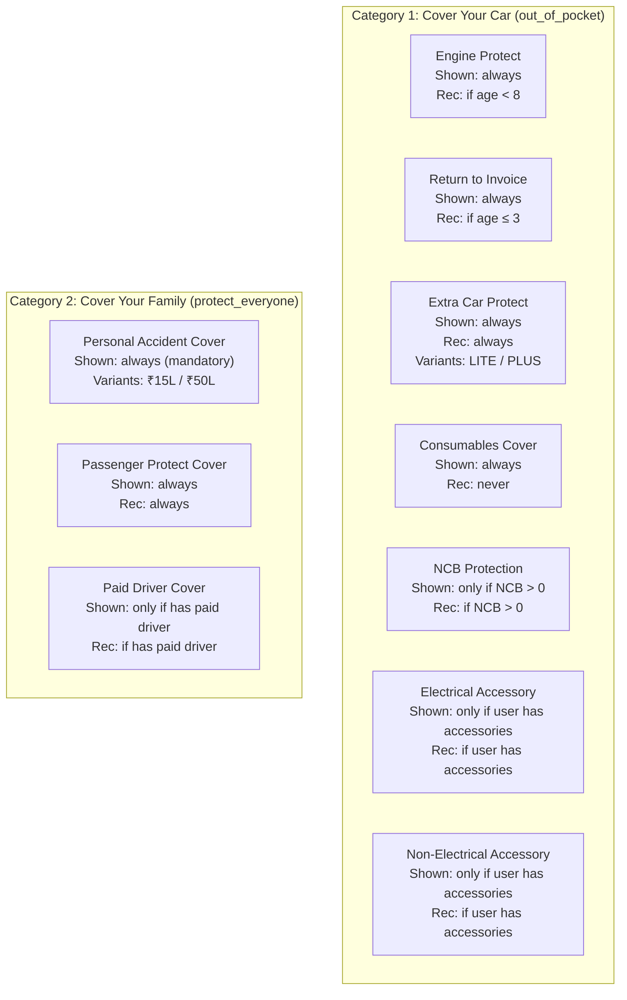

---

## 10. Owner Details & Pre-Payment

After add-ons, the system collects owner information needed for the policy.

```mermaid
flowchart TB
    INTRO["owner_details.intro<br/>'Almost there. A few details about<br/>the vehicle owner to issue the policy.'"]
    INTRO --> NAME["owner_details.name<br/>Widget: text_input<br/>'Vehicle owner's full name?'<br/>Pre-fills from earlier name or profile<br/>Must match RC"]

    NAME --> LOGIN_CHECK{Logged in?}
    LOGIN_CHECK -->|No| SKIP_GATE["login.phone_gate<br/>Widget: login_gate_skippable<br/>'Verify your phone number'"]
    LOGIN_CHECK -->|Yes| EMAIL

    SKIP_GATE --> EMAIL["owner_details.email<br/>'Your email address?'<br/>Pre-fills if available"]

    EMAIL --> BN_CHECK{Brand new vehicle?}
    BN_CHECK -->|Yes| ENGINE["owner_details.engine_number<br/>'Engine number?'<br/>(from dealer invoice)"]
    BN_CHECK -->|No| LOAN_CHECK

    ENGINE --> CHASSIS["owner_details.chassis_number<br/>'Chassis number?'"]
    CHASSIS --> GST["owner_details.gst<br/>'Do you have a GST number?'<br/>Skip / Enter"]
    GST -->|Enter| GST_INPUT["owner_details.gst_input<br/>'Enter your GST number'"]
    GST -->|Skip| LOAN_CHECK
    GST_INPUT --> LOAN_CHECK

    LOAN_CHECK["owner_details.loan_check<br/>'Have you taken a car loan?'<br/>I own it outright / It's financed"]
    LOAN_CHECK -->|Financed| LOAN_PROVIDER["owner_details.loan_provider<br/>'Who is the lender?'"]
    LOAN_CHECK -->|Own outright| MANDATORY_GATE

    LOAN_PROVIDER --> MANDATORY_GATE

    MANDATORY_GATE{Logged in?}
    MANDATORY_GATE -->|Yes| REVIEW
    MANDATORY_GATE -->|No| MANDATORY["login.phone_gate_mandatory<br/>Widget: login_gate_mandatory<br/>MUST login to proceed"]
    MANDATORY --> REVIEW

    REVIEW["review.premium_breakdown<br/>Widget: premium_breakdown<br/>'Complete breakdown of your plan'"]
    REVIEW --> PAYMENT([→ Payment])
```

---

## 11. Payment & Post-Purchase

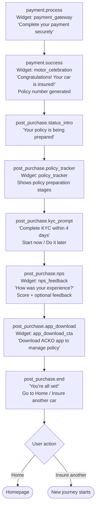

---

## 12. PWILO — Pick Up Where I Left Off

The journey state is automatically saved at key milestones. If the user leaves and returns, they can resume.

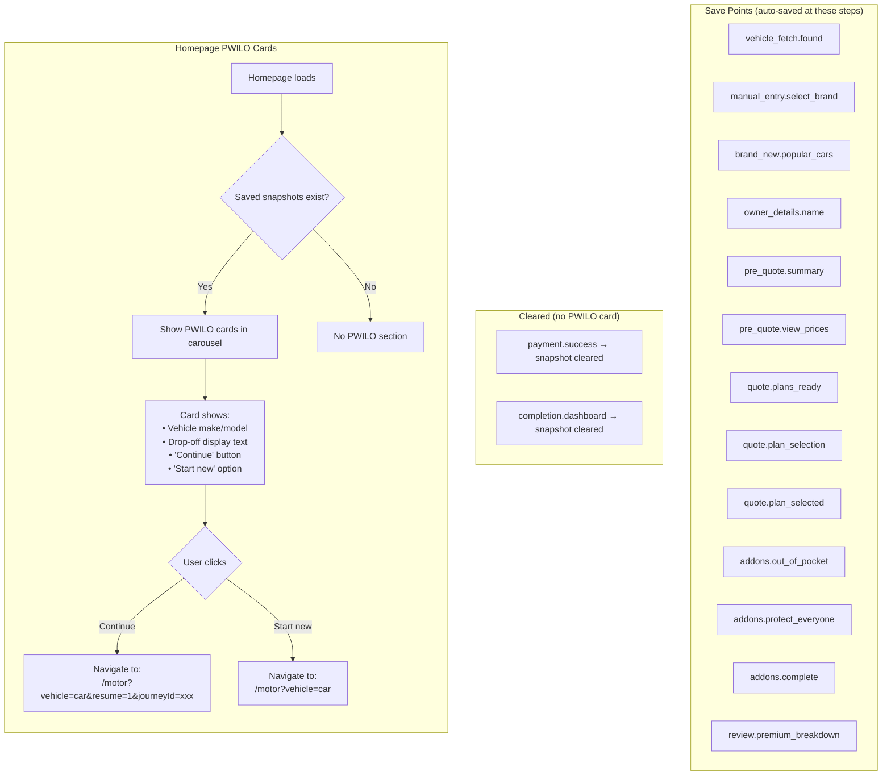

### Drop-off Display Mapping

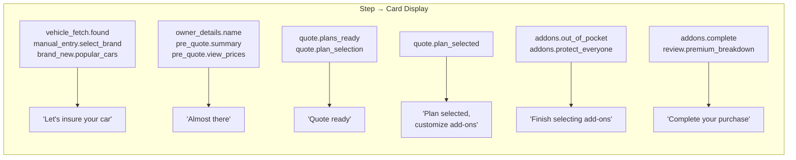

---

## 13. Step Reference Table

Complete list of all step IDs in the car journey, grouped by module.

| Module | Step ID | Widget Type | Purpose |
|--------|---------|-------------|---------|
| **registration** | `registration.has_number` | `selection_cards` | Renewal vs Brand New fork |
| | `registration.enter_number` | `vehicle_reg_input` | Enter registration number |
| **vehicle_fetch** | `vehicle_fetch.loading` | `progressive_loader` | Fetch vehicle details from API |
| | `prelim.check` | `none` | Run preliminary checks |
| | `prelim.insured_same_user` | `selection_cards` | Vehicle already insured (same user) |
| | `prelim.insured_different_user` | `selection_cards` | Vehicle already insured (different user) |
| | `prelim.two_wheeler_entered` | `selection_cards` | Two-wheeler registration entered |
| | `prelim.payment_pending` | `selection_cards` | Payment done, pending steps |
| | `vehicle_fetch.found` | `vehicle_details_card` | Show verify card with fetched data |
| **manual_entry** | `manual_entry.congratulations` | `none` | Brand new car excitement message |
| | `manual_entry.start` | `none` | Fetch failed, start manual entry |
| | `manual_entry.select_brand` | `brand_selector` | Select car make |
| | `manual_entry.select_model` | `model_selector` | Select car model |
| | `manual_entry.select_fuel` | `selection_cards` | Select fuel type |
| | `manual_entry.select_variant` | `variant_selector` | Select car variant |
| | `manual_entry.select_year` | `year_selector` | Select registration year |
| | `brand_new.popular_cars` | `selection_cards` | Popular car suggestions |
| | `brand_new.commercial_check` | `selection_cards` | Personal vs commercial use |
| | `brand_new.delivery_date` | `selection_cards` | Expected delivery window |
| | `brand_new.mobile_pincode` | `text_input` | Mobile number |
| | `brand_new.pincode` | `text_input` | Pincode |
| | `brand_new.summary` | `editable_summary` | Review brand new car details |
| | `brand_new.view_prices` | `none` | Transition to quote calculation |
| **pre_quote** | `pre_quote.pincode_ask` | `text_input` | Pincode (when not collected) |
| | `pre_quote.policy_type_ask` | `selection_cards` | Previous policy type |
| | `pre_quote.policy_status` | `selection_cards` | Active / Expired / Not sure |
| | `pre_quote.claim_history` | `selection_cards` | Claims in current policy |
| | `pre_quote.ncb_selection` | `ncb_selector` | NCB percentage |
| | `pre_quote.ncb_reward` | `ncb_reward` | NCB increase celebration |
| | `pre_quote.last_claim_ask` | `selection_cards` | Last year claim (when not fetched) |
| | `pre_quote.cng_check` | `selection_cards` | External CNG kit check |
| | `pre_quote.commercial_check` | `selection_cards` | Commercial use check |
| | `pre_quote.commercial_rejection` | `rejection_screen` | Commercial vehicle dead end |
| | `pre_quote.expired_policy_type` | `selection_cards` | Previous policy type (expired path) |
| | `pre_quote.expiry_window` | `selection_cards` | When did policy expire |
| | `pre_quote.expired_claim_history` | `selection_cards` | Claims during previous policy |
| | `pre_quote.expired_insurer` | `insurer_selector` | Previous insurer |
| | `pre_quote.summary` | `editable_summary` | Review all details before quote |
| | `pre_quote.view_prices` | `none` | Transition to quote calculation |
| **login** | `login.phone_gate_prequote` | `login_gate_skippable` | Skippable login during data collection |
| | `login.phone_gate` | `login_gate_skippable` | Skippable login after owner name |
| | `login.phone_gate_before_plans` | `login_gate_mandatory` | Mandatory login before showing plans |
| | `login.phone_gate_mandatory` | `login_gate_mandatory` | Mandatory login before premium review |
| **quote** | `quote.calculating` | `plan_calculator` | Calculate plans (progressive stages) |
| | `quote.plans_ready` | `none` | Plans found message |
| | `quote.plan_selection` | `plan_selector` | Plan cards + bottom sheets |
| | `quote.plan_selected` | `none` | Plan confirmed message |
| **help** | `help.usage_pattern` | `selection_cards` | How do you use your car? |
| | `help.vehicle_age` | `selection_cards` | How old is your car? |
| | `help.budget_priority` | `selection_cards` | What matters most? |
| | `help.repair_preference` | `selection_cards` | Repair priority? |
| | `help.recommendation` | `plan_recommendation` | AI plan recommendation |
| **addons** | `addons.paid_driver_question` | `selection_cards` | Has paid driver? |
| | `addons.accessories_question` | `selection_cards` | Has aftermarket accessories? |
| | `addons.out_of_pocket` | `out_of_pocket_addons` | Car protection add-ons |
| | `addons.protect_everyone` | `protect_everyone_addons` | Family protection add-ons |
| | `addons.complete` | `none` | Add-on summary message |
| **owner_details** | `owner_details.intro` | `none` | Owner details intro |
| | `owner_details.name` | `text_input` | Owner full name |
| | `owner_details.email` | `text_input` | Owner email |
| | `owner_details.engine_number` | `text_input` | Engine number (brand new only) |
| | `owner_details.chassis_number` | `text_input` | Chassis number (brand new only) |
| | `owner_details.gst` | `selection_cards` | GST number (optional) |
| | `owner_details.gst_input` | `text_input` | Enter GST number |
| | `owner_details.loan_check` | `selection_cards` | Car loan check |
| | `owner_details.loan_provider` | `text_input` | Loan provider name |
| **review** | `review.premium_breakdown` | `premium_breakdown` | Full premium breakdown |
| **payment** | `payment.process` | `payment_gateway` | Payment processing |
| | `payment.success` | `motor_celebration` | Payment success celebration |
| **post_purchase** | `post_purchase.status_intro` | `none` | Policy preparation intro |
| | `post_purchase.policy_tracker` | `policy_tracker` | Policy tracker widget |
| | `post_purchase.kyc_prompt` | `selection_cards` | KYC prompt |
| | `post_purchase.nps` | `nps_feedback` | NPS feedback |
| | `post_purchase.app_download` | `app_download_cta` | App download CTA |
| | `post_purchase.end` | `selection_cards` | Journey complete |
